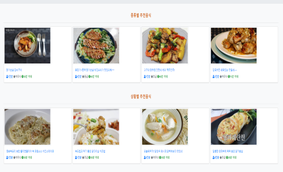
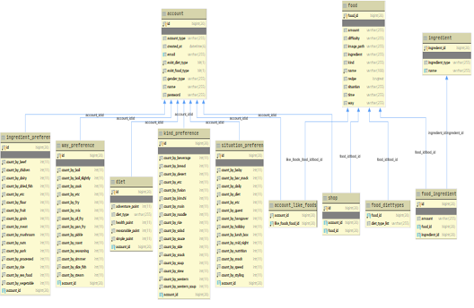

# Maeju-Web-Service
**음식 추천형 웹 사이트**

**사용자의 식단 유형과 음식 선호도 유형을 조사하여 사용자에게 적절한 음식을 추천해주는 웹 플랫폼**

**메인 페이지**

**음식 추천 페이지**

#### 기술 스택

SpringBoot Framework

Spring Data JPA, QueryDsl, Spring Security

Travis CI, Amazon EC2, S3, Code Deploy ( 더 이상 사용하지 않음 )

배포용 DB로 RDS의 MariaDB를 사용

로컬 DB로 MySQL를 사용

